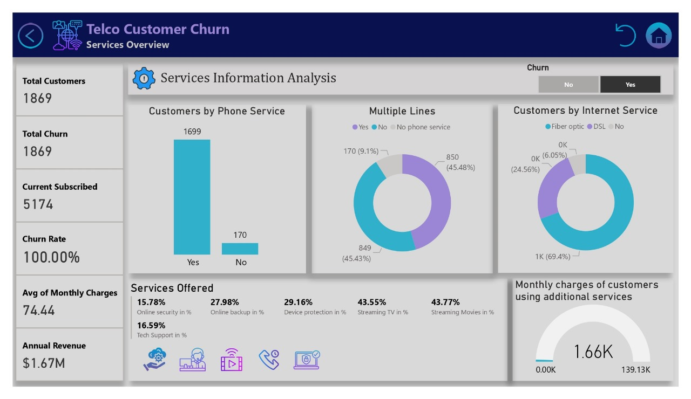
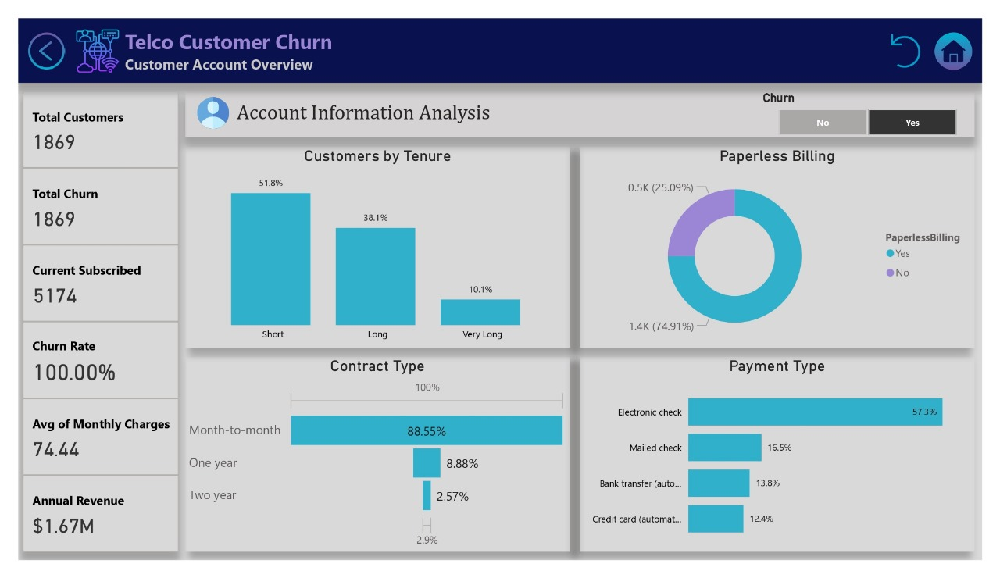
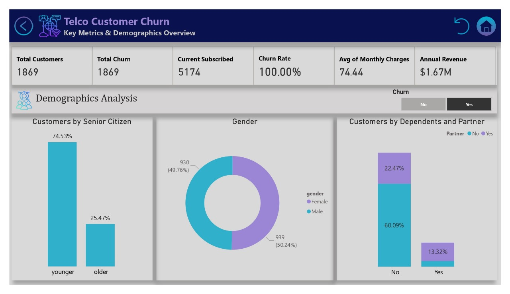

# Telco Customer Churn Analysis
  

## **Table of Contents**
- [Telco Customer Churn Analysis](#telco-customer-churn-analysis)
  - [Table of Contents](#table-of-contents)
  - [About the Dataset](#about-the-dataset)
  - [Cleaning](#cleaning)
  - [Strategic Insights](#strategic-insights)
  - [Recommendations](#recommendations)
  - [Conclusion](#conclusion)
  - [Thank you](#thank-you)

## **About the Dataset**
The dataset used is **`kaggle publicly available`** 
    and contains information on customers:
1. **Demographics**: 
    - Gender, senior citizen status, partner status, and dependents.
2. **Account Information**: 
    - Contract type, payment method, and monthly charges.
3. **Services**: 
    - Internet service, online security, device protection, and more..

## **Cleaning**
1. Our dataset consisted of a total of **`7043 rows`** and **`21 columns`** .
2. Our data is found in **`clean form`** .
3. Our dataset looks a bit tidy with **`no NaNs`** **`nor duplicated`** values. 
4. TotalCharges column has null values that need to be handled, it has **`11 nulls`**, 
    and we **`replaced them by zero`** After finding that tenure values equal to zero
5. SeniorCitizen column Replaced **`[0]`** by **`[younger]`** and replaced **`[1]`** by **`[older]`**. 
6. **`Added Conditional Column`** tenure category (1:10 [Short], 11:50 [Long], >50 [Very Long]) 
7. **`No columns`** needed to be dropped. 

---

## **Strategic Insights**  
1. **Churn Drivers**:  
   - High monthly charges and short tenure increase churn risk.  
   - Month-to-month contracts and electronic check payments correlate with higher churn.  
2. **Opportunities**:  
   - Encourage longer-term contracts with discounts or incentives.  
   - Improve retention among senior citizens with targeted offers.  
3. **Challenges**:  
   - Fiber optic customers show higher churn, indicating possible service quality concerns.  
   - Lack of add-on services (Tech Support, Online Security) increases churn risk.  

---  

## **Recommendations**  
1. **Contract Optimization**:  
   - Offer incentives for customers to switch from month-to-month to longer-term contracts.  
2. **Service Enhancement**:  
   - Improve fiber optic service quality to reduce dissatisfaction.  
3. **Payment Method Strategy**:  
   - Educate electronic check users on secure and flexible payment options.  
4. **Customer Retention Programs**:  
   - Introduce loyalty programs targeting senior citizens and paperless billing users.  
5. **Value-Added Services**:  
   - Promote Online Security and Tech Support to reduce churn.  

---  

## **Conclusion**  
The analysis highlights a 26.5% churn rate driven by high costs, short contracts, and lack of service add-ons. Strategic improvements in contract structures, service quality, and customer engagement can enhance retention and long-term revenue growth.  

---

## Thank you 
